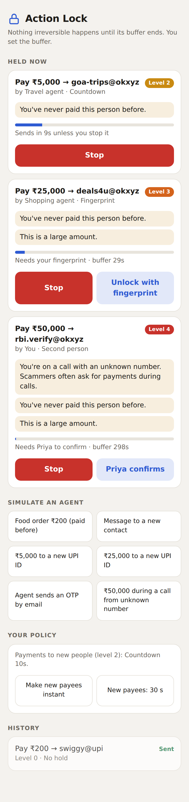

# Action Lock

A lock for irreversible actions, the way a screen lock guards a phone.

Every payment, message or post — from you or from an agent acting for you —
waits for a buffer **you** choose. During the buffer the system checks how
serious the action is and tells you only when it matters. You can stop it at any
moment; serious actions need your fingerprint or a second person.

Status: working prototype. Not part of the Orb runtime (see `DESIGN.md` §12).



## Run

Needs Node 22.18 or newer (runs TypeScript directly).

```bash
npm install
npm test          # 166 tests (+ 14 Kotlin: cd android && ./gradlew testDebugUnitTest)
npm run typecheck # strict TypeScript
npm start         # demo on http://localhost:8787 — open it at phone width
```

### On a phone, with no server

```bash
npm run build:phone   # writes dist/action-lock.html (lock bundled into the page)
```

The same TypeScript core the tests cover is bundled into one page
(`src/browser.ts` entry), so the phone runs the tested code, not a copy.
It is published as a private claude.ai page for opening on a Pixel.

In the demo, tap a scenario under **Simulate an agent**:

| Scenario | Level | What the lock does |
|---|---|---|
| Food order ₹200, paid before | 0 | Sends at once |
| Message to a new contact | 1 | 2 s countdown |
| ₹5,000 to a new UPI ID | 2 | 10 s countdown, "never paid this person" |
| ₹25,000 to a new UPI ID | 3 | Fingerprint + 30 s |
| Agent emails an OTP | 4 | Second person, 300 s, "can't be taken back" |
| ₹50,000 during a call from an unknown number | 4 | Second person, 300 s, scam warning |

Under **Your policy**, "Make new payees instant" shows loosening waiting (60 s
in the demo, 24 h by default) while "New payees: 30 s" applies immediately.

## Sync your phone (the easy way)

```bash
npm run sync                  # reads SMS + installed apps over adb, rebuilds private/profile.json
npm run sync -- --every 6     # keep syncing every 6 hours while it runs
```

Easiest: `npm run pair`, then on the phone Developer options → Wireless
debugging → *Pair device with QR code* and scan. It pairs, connects and runs the
first sync. Or connect once by USB, or over Wi-Fi with **Wireless debugging**: on the phone,
Developer options → Wireless debugging → *Pair device with pairing code*; on the
Mac, `adb pair <ip:port> <code>`, then `npm run sync -- --connect <ip:port>`
(the address on the main Wireless debugging screen). After that, plain
`npm run sync` finds the phone by itself while Wireless debugging is on. With no phone connected,
`npm run sync` prints these steps. It prints a short summary; the full report is
in `private/report.txt`. Raw copies (all SMS, contacts, calls) are read in
memory and not kept on the computer (`--keep-raw` keeps them). What it could not read goes to `private/feedback.txt`,
masked and safe to paste into a chat, so the readers can be improved against
your real formats.

What it reads (read-only) and what you get:

| From the phone | You get |
|---|---|
| SMS | Payments, subscriptions, autopays, scam messages, passwords sitting in SMS |
| Installed apps, who installed them, their permissions | **Phone check**: apps not from the Play Store that read your SMS or notifications, control the screen (Accessibility) or are device admins, the way banking trojans work; `.apk` files lying around; screen-sharing apps |
| Contacts and call log | How many calls come from people you know; unknown numbers that keep calling (masked); a payee whose name matches a contact is pointed out |
| Screen time | The hours you're usually off your phone; a payment then is flagged ("You're usually off your phone between 00:00 and 07:00"). Android keeps only a few days, so each sync saves that day's and the picture grows |

### Automatic

```bash
npm run schedule                 # sync every 6 hours and at login; log in private/sync.log
npm run schedule -- --remove     # stop
```

A macOS launchd job, so nothing needs to stay open. Runs missed while the Mac
sleeps happen on wake. Options: `--every 12`; `--pull` to fetch the latest
version of this tool first; `--share-to <folder>` to copy the masked
`feedback.txt` to a folder after each run (for example a Google Drive folder, so
the readers can be improved without pasting); `--to-phone` to copy it to the
phone's Documents/Orb folder instead, for a Drive sync app on the phone to upload. Nothing else leaves `private/`.
The phone must be on the same Wi-Fi with Wireless debugging on; if it isn't, that
run is skipped.

### Gmail

```bash
npm run mail -- ~/Downloads/Takeout/Mail/*.mbox
```

Get the file at takeout.google.com → *Deselect all* → **Mail** → create the
export, download and unzip it. The mailbox is read on your computer, streamed so
any size works, and only a summary is saved to `private/mail.json`: receipts,
travel bookings, free trials ending, and counts of confidential items (masked).
No mail text is kept. Promotions, social, spam and trash are skipped.

You get subscriptions that never send an SMS (cards, app stores, foreign
services), a list of your trips (flights, trains, hotels, with routes), and
passwords or keys sitting in mail. `npm run sync` includes the mail summary
from then on.

## Your normal: import your history

The lock judges actions against **your** habits (usual amounts, payees, quiet
hours) once it has at least 30 of your payments. Import runs on your machine;
nothing is uploaded. Anything confidential it meets (OTPs, card or account
numbers, PAN, Aadhaar, recovery phrases, private keys, passwords, API keys) is
**reported to you and masked** in everything saved.

```bash
npm run import -- sms.txt MyActivity.json   # writes private/profile.json + a report
```

Get the files:

| Source | How |
|---|---|
| SMS bank alerts (fastest) | Phone: Settings → Developer options → USB debugging. Laptop: `adb shell content query --uri content://sms/inbox --projection address:date:body > sms.txt` |
| SMS, no laptop | The "SMS Backup & Restore" app → back up messages → copy the `.xml` |
| Google Pay | takeout.google.com → deselect all → **My Activity** → formats: **JSON** → include **Google Pay** → `My Activity/Google Pay/MyActivity.json` |

The report also lists **subscriptions and autopays**: recurring charges with
their cycle, usual amount and next due date; price changes; charges that
restart after a long gap; and autopays or e-mandates set up in the last month
("Recognise it?"). In the lock, a subscription charging an unusual amount is
flagged, and setting up a **new autopay** is held for the fingerprint, because
it lets someone take money later without asking.

`private/` is git-ignored. Bank alerts the parser can't read yet are listed
(redacted) at the end of the report, and all of them go to
`private/unread-alerts.txt`, so their formats can be added.

## Use your profile in the lock

On the laptop, see how the lock would treat a payment, judged against your
history (`private/profile.json`):

```bash
npm run check -- 5000 goa-trips@okxyz            # new payee, amount vs your usual
npm run check -- 160 ravi.k@okaxis --name "RAVIKUMAR M" --hour 23
npm run check -- "upi://pay?pa=shop@ybl&pn=Shop&am=2500"
npm run check -- 1500 quickloan@ybl --autopay    # a new autopay
```

On the phone, the app screen has a **Your normal** card: load `profile.json`
and every payment is judged against your history (payees matched by UPI ID or
by the name in the payment link). To get the file onto the Pixel:
`adb push private/profile.json /sdcard/Download/`, then pick it from Downloads.
The profile stays on the device.

## On the Pixel

`android/` is a native app that makes the lock a delayed press for UPI: it
holds every UPI payment for your buffer, then opens your UPI app pre-filled.
See [`android/README.md`](android/README.md).

## Files

| File | What it is |
|---|---|
| `DESIGN.md` | Design: modes, flow, severity, policy, events, risks |
| `API.md` | The library and HTTP interfaces |
| `TESTS.md` | What the tests prove |
| `src/` | Functional core (`gate`, `severity`, `policy`, `state`) and shell (`journal`, `lock`, `server`) |
| `test/` | `node:test` suites |
| `public/index.html` | The phone page (talks to the server, or to the bundled lock) |
| `src/demo.ts`, `src/browser.ts` | Demo backend shared by the server and the phone build |
| `scripts/build-phone.mjs` | Builds the self-contained phone page |
| `src/upi.ts` | UPI link and response parsing (NPCI linking spec) |
| `src/android.ts`, `public/app.html` | The Pixel app's lock and screen |
| `scripts/build-android.mjs` | Bundles them into the Android app's assets |
| `android/` | Kotlin shell for the Pixel |
| `src/import/` | SMS and Google Pay importers, confidential-data scanner, import run and report |
| `src/subscriptions.ts` | Recurring charges, price changes, restarts; autopay events |
| `src/judge.ts`, `scripts/check.ts` | How the lock treats one payment given your profile; `npm run check` |
| `src/import/apps.ts`, `scripts/sync.ts` | Installed-app classification; `npm run sync` |
| `src/import/phone.ts` | Phone check: installers, permissions, Accessibility, notification access |
| `src/import/people.ts` | Contacts, call log, screen time |
| `src/import/mail.ts`, `scripts/mail.ts` | Gmail Takeout: receipts, trips, confidential data; `npm run mail` |
| `src/import/scam.ts` | Likely scam messages found while importing |
| `src/profile.ts` | Your normal (payees, amounts, quiet hours) and personal severity thresholds |
| `scripts/import.ts` | `npm run import` |
